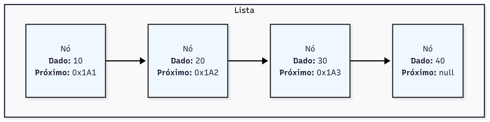
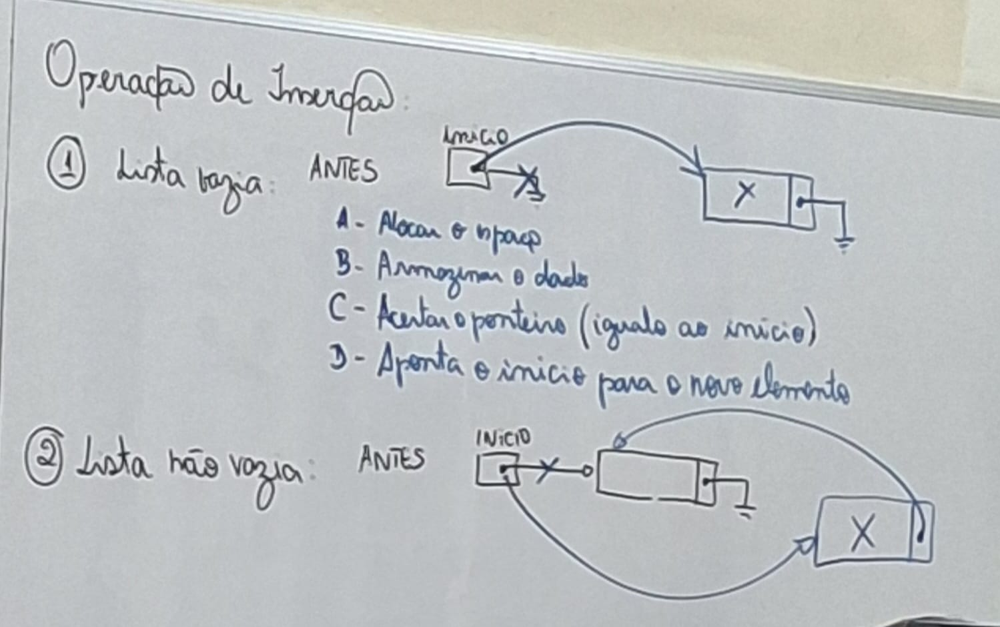
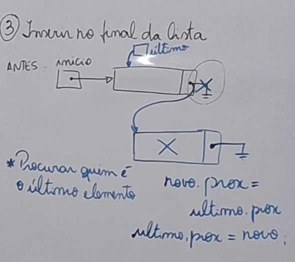
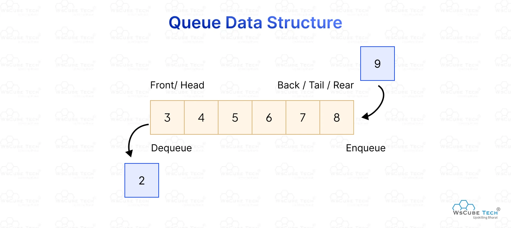
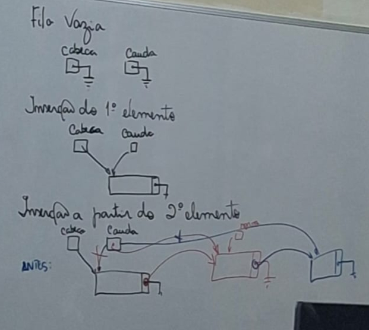
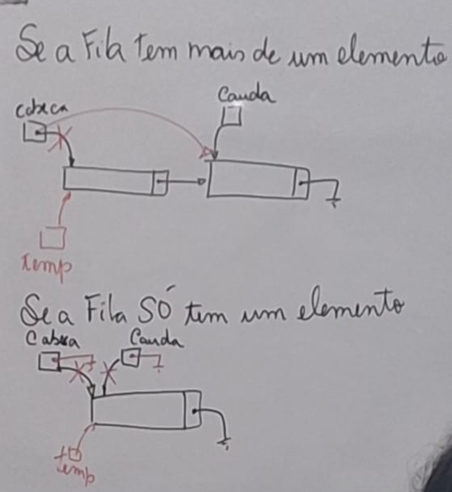
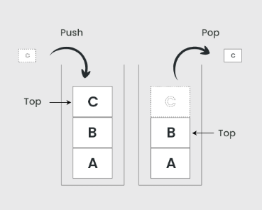

# Estruturas Homogêneas Dinâmicas

- Homogêneas: contém elementos de mesmo tipo

- Dinâmicas: seu tamanho (n. de elementos) muda durante o uso

## Linked List / Chained List

> Sequência de elementos em que cada nó contém uma referência (ponteiro) para seu sucessor (e opcionalmente para seu antecessor, em listas duplamente encadeadas), permitindo a ligação entre os elementos.

  
<small>Obs: Nas implementações das estruturas, o professor utilizou `info` para nomear a porcão que contem o dado que o node armazena. No entanto, para manter a consistência com o diagrama acima, optei por usar a palavra `data` (dado)</small>

### Operação de inserção

#### 3. Inserir no final da lista

## Filas (Queue)

> Estrutura em que a inserção ocorre **sempre** no final e a remoção **sempre** no inicio

Exemplos: 

- Fila de impressão
- Fila de execução de processos
- Fila de pagamento em e-commerce

### Operações em Filas

- **enqueue(elemento)**: inserir
- **dequeue()**: remover
- **peek()** ou **front()**: consulta o primeiro elemento, sem removê-lo

  

## Pilha (Stack)
 
> Estrutura em que a inserção e a remoção/consulta **sempre** ocorro no TOPO (entenda como inicio)

- Visão é na direção vertical 
  

Exemplo:

- pilha de execução de funções

### Operações em Pilhas

- **push(elemento)**: inserir
- **pop()**: remover
- **peek()**: consulta o topo, sem remover

## Lista Ordenada

> Garante que os elementos estejam em uma ordem pré-determinada

### Inserindo: 

- Quando vazia: não muda nada em relação à lista convencional

- Quando o novo elemento é o menor: insere no inicio

- Quando o novo elemento é o maior: insere no fim

- Quando o novo elemento é "intermediário" (no meio dos outros): inserir entre dois elementos